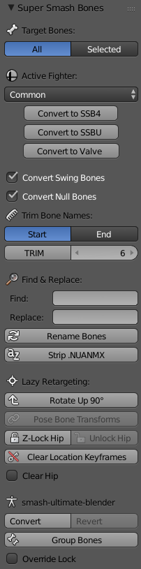

# Super Smash Bones
Blender 2.79 plugin that automatically converts Smash Bros. character rigs between various preconfigured states

=====================================
### Supports Automatic Conversion To:
1.  Smash for Wii U
2.  Smash Ultimate
3.  smash-ultimate-blender's temp rigs
4.  Valve Biped

Conversion is non-destructive and can cycle back and forth on demand. \
Also includes various useful tools for working with the rigs.  Comes with [Pose Bone Transforms](https://github.com/Blaco/Pose-Bone-Transforms/)

## The primary purpose of this plugin is to quickly and effortlessly port animations and models both between Smash 4 and Smash Ultimate, and also out of Blender for use in Source. Wii U models can be turned into Ultimate models in a single click and vice-versa. Embedded tools let you fix import issues and retarget animations to other rigs with a simple, easy to use interface.

## Bonemaps:
The plugin uses a bonemap file to record a fighter's Wii U and Ultimate bone names, and also assign Valve biped names to unique bones that do not appear on other characters. Most common bones will be tagged just by using the 'Common' group, but to truly tag every single bone on a character and fully convert their rig, the bonemap must be filled in with their unique bone names and it must be the **'Active Fighter'** in the tool window while performing conversion operations.

Currently I have completed the 'Common' biped/system bones, and the following characters:   **Link**   **Palutena**   **Zelda**

Mapping every single fighter's unique bones is a significant task that I probably won't do myself, but it is very easy to do it yourself if you decide you want the functionality for a new fighter, since you only need to add bones unique to the fighter (i.e. bones not already in 'Common') The bonemap tuples can be expanded to include more and more fighters and mappings without any issue.

### For example, Link only required mappings for his equipment, and nothing else:
```
    "Link": (
        False,  # ClavicleC
        False,  # LegC
        [
            # Equipment
            ("ValveBiped.Bip01_Attachment_Slate", "prp_sheikah_slate", "SekibanN", "sheikahstone"),
            ("ValveBiped.Bip01_Attachment_Quiver", "prp_quiver", "YadutsuN", "queiver"),
            ("ValveBiped.Bip01_Attachment_Scabbard", "prp_scabbard", "SayaN", "Scabbard"),
            ("ValveBiped.Bip01_Attachment_Scabbard_Bow", "prp_scabbard_bow", "SayaYumiN", "BowB"),
            ("ValveBiped.Bip01_Attachment_Scabbard_Shield", "prp_scabbard_shield", "SayaTateN", "ShieldB"),
            ("ValveBiped.Bip01_Attachment_Scabbard_Sword", "prp_scabbard_sword", "SayaTukaN", "Hilt"),
            ("ValveBiped.Bip01_Attachment_Shield", "prp_shield", "TateN", "Shield"),
            ("ValveBiped.Bip01_Attachment_Sword0", "prp_sword_1", "KenJ", "Sword1"),
            ("ValveBiped.Bip01_Attachment_Sword1", "prp_sword_2", "KenModelN", "Sword2"),
        ]
    ),
```
- ClavicleC and LegC tells the plugin if it should create these bones if they are missing during Ultimate conversion.
- Both HL2/Gmod and TF2 style Valve Biped names are supported. **The index order is: (HL2, TF2, SSB4, SSBU)**

## Installation
    1. Go to Code > Download Zip
    2. Extract the .zip to %AppData%/Blender Foundation/Blender/2.79/scripts/addons/
    3. Rename the super_smash_bones-2.79 folder to ssb4_ssbu
    4. In Blender's User Preferences > Addons, enable Rigging: Super Smash Bones
    4. Find the controls in its own panel in the Tool Shelf of the 3D View
    5. You can change the Valve Biped settings in User Preferences


Currently only Blender 2.79 compatible, might update to modern api later when I feel this is feature complete.

<pre>                                       </pre>
